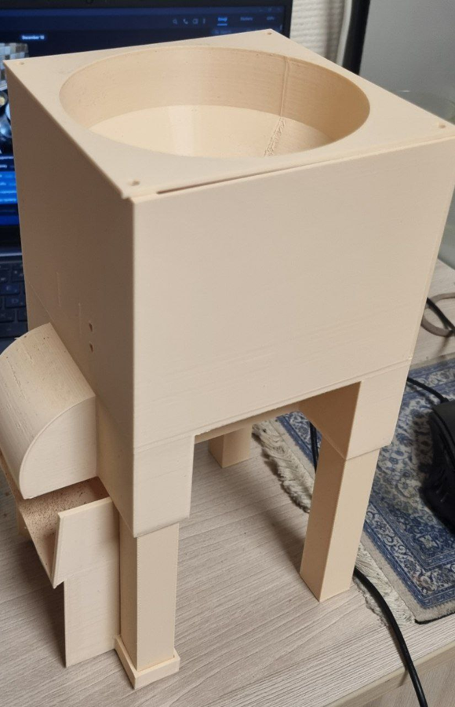
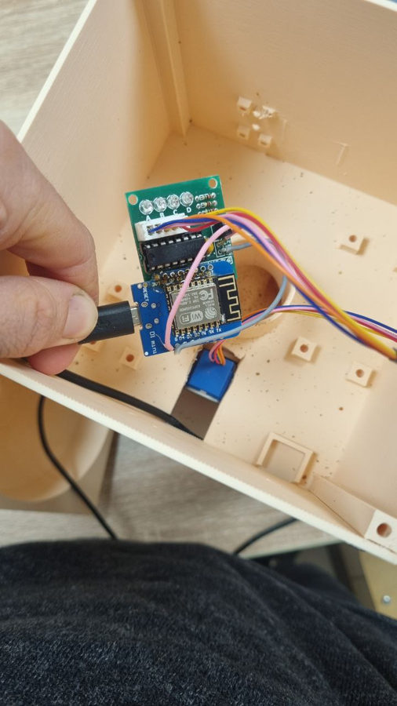
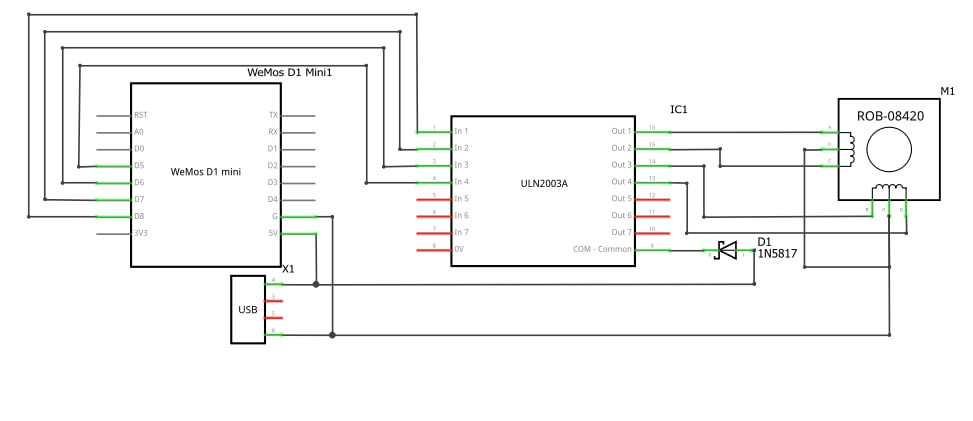
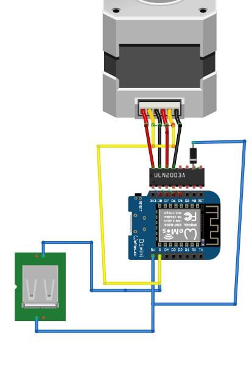

# 🐾 AutoFeeder — автоматическая кормушка на ESP8266

Автоматическая кормушка для домашних животных на **Wemos D1 mini (ESP8266)**.
Корм выдаётся по расписанию (до 4 таймеров) или по кнопке в веб-интерфейсе. Время берётся по NTP, настройки хранятся в EEPROM.

> Курсовой проект по дисциплине «Микропроцессорные системы», СамГТУ, Институт автоматики и информационных технологий, 4-ИАИТ-103.
> Авторы: **Н.А. Глебов**, **Е.А. Салюков**. Руководитель: О.В. Прохорова. Самара, 2025.

<p align="center">
  
  
</p>

## Возможности

- Веб-интерфейс прямо на контроллере: время/дата, последняя раздача, все настройки.
- 4 независимых таймера кормления (часы, минуты, порция, вкл/выкл).
- Ручная раздача кнопкой «Покормить».
- Общий множитель порций (1–20), влияющий и на ручную раздачу, и на таймеры.
- Время по NTP (`pool.ntp.org`, часовой пояс **UTC+4**).
- Настройки и Wi-Fi сохраняются в EEPROM и переживают перезагрузку.
- Если сохранённой сети нет или подключиться не удалось — контроллер поднимает точку доступа для первичной настройки.
- После раздачи обмотки двигателя обесточиваются.

## Железо

| Компонент | Назначение |
|---|---|
| Wemos D1 mini (ESP8266) | Контроллер, Wi-Fi, веб-сервер |
| Шаговый двигатель 28BYJ-48 | Привод дозатора/шнека |
| Драйвер ULN2003 | Управление обмотками двигателя |
| Блок питания 5 В, ≥1 А (лучше 2 А) | Питание платы и двигателя |
| Диод 1N5817 | Защитный диод на общем выводе ULN2003 (см. схему) |
| Провода Dupont, корпус, шнек | Монтаж и механика |

### Подключение

| Wemos D1 mini | ULN2003 |
|---|---|
| `D5` | `IN1` |
| `D6` | `IN2` |
| `D7` | `IN3` |
| `D8` | `IN4` |
| `5V` | питание драйвера / `+` |
| `G`  | `GND` |

Питание — 5 В (micro-USB или внешний блок).

<p align="center">
  <br>
  
</p>

## Сборка и прошивка

1. Установите [Arduino IDE](https://www.arduino.cc/en/software) (1.8+ или 2.x).
2. Добавьте поддержку ESP8266: *Файл → Настройки → Дополнительные ссылки для менеджера плат* — `https://arduino.esp8266.com/stable/package_esp8266com_index.json`, затем *Инструменты → Плата → Менеджер плат* → установите **esp8266**.
3. Выберите плату **LOLIN(WEMOS) D1 R2 & mini**.
4. Откройте `AutoFeeder/AutoFeeder.ino` и загрузите скетч.

Используются только библиотеки из ядра ESP8266: `ESP8266WiFi`, `ESP8266WebServer`, `EEPROM`, `time.h`.

## Первый запуск

1. После включения плата ищет сохранённую Wi-Fi сеть. Если её нет — создаётся точка доступа:
   - SSID: `AutoFeeder_Setup`
   - пароль: `12345678`
2. Подключитесь к ней и откройте `http://192.168.4.1`.
3. Введите SSID и пароль вашей сети — плата перезагрузится и подключится к ней.
4. Узнайте IP устройства в Serial Monitor (115200 бод) или в списке клиентов роутера и откройте его в браузере.
5. Дождитесь синхронизации времени (до этого таймеры не срабатывают) и настройте расписание.

Сменить сеть можно кнопкой «Сбросить Wi-Fi» — устройство снова перейдёт в режим точки доступа.

> **Часовой пояс** задаётся в скетче константой `gmtOffset_sec` (сейчас `14400` = UTC+4, Самара). Измените её под свой регион.

## Как это работает

- Раз в минуту (при совпадении часов и минут) проверяются активные таймеры. Один таймер не сработает дважды в течение одной и той же минуты.
- Порция = базовая порция таймера × общий множитель. Одна «порция» — один цикл: **100 шагов вперёд и 40 назад** (обратный ход нужен, чтобы не заклинивало шнек).
- Повторный запуск во время раздачи игнорируется.
- Все значения ограничиваются допустимыми диапазонами: часы 0–23, минуты 0–59, порции и множитель 1–20.
- Если EEPROM пуста, по умолчанию включается таймер на 12:30 с порцией 3.

### Маршруты веб-сервера

| Путь | Действие |
|---|---|
| `/` | Главная страница |
| `/feednow?manual=N` | Ручная раздача |
| `/set?multiplier=N` | Общий множитель порции |
| `/settimer` | Сохранение 4 таймеров |
| `/setwifi?ssid=…&pass=…` | Сохранить Wi-Fi и перезагрузиться |
| `/clearwifi` | Сбросить Wi-Fi и перезагрузиться в AP |

### Карта EEPROM (128 байт)

| Адрес | Содержимое |
|---|---|
| `0` | Флаг «Wi-Fi сохранён» |
| `1…32` | SSID (длина + символы) |
| `33…64` | Пароль (длина + символы) |
| `65…80` | 4 таймера × 4 байта (час, минута, порция, вкл) |
| `81` | Порция ручной раздачи |
| `82` | Общий множитель |

### Состояния системы

| | x0 | x1 | x2 | x3 | x4 |
|---|---|---|---|---|---|
| **S0** | S1 | | | | |
| **S1** | | S2 | S3 | | |
| **S2** | | | | S6 | |
| **S3** | | | S4 | S5 | |
| **S4** | | | | S3 | |
| **S5** | | | | S3 | |
| **S6** | | | | | S0 |

S0 — старт; S1 — подключение к Wi-Fi и ожидание NTP; S2 — режим точки доступа; S3 — нормальная работа; S4 — кормление по таймеру; S5 — ручное кормление; S6 — перезапуск после сохранения Wi-Fi.
x0 — подача питания; x1 — Wi-Fi не подключён; x2 — Wi-Fi подключён, время получено; x3 — сработал таймер; x4 — ручной запуск или сохранение Wi-Fi.

## Структура репозитория

```
AutoFeeder/AutoFeeder.ino          основной скетч
examples/WebServerTest/            тест веб-сервера в режиме AP (Приложение 1)
docs/img/                          схемы и фотографии
```

## Ограничения

- Нет аппаратных часов (RTC): без Wi-Fi/NTP время недоступно и таймеры не работают.
- У веб-интерфейса нет авторизации — используйте в доверенной домашней сети.
- Пароль Wi-Fi хранится в EEPROM в открытом виде; пароль точки доступа задан в коде.

## Демонстрация

[Видео работы (Яндекс.Диск)](https://disk.yandex.ru/i/7jK5LY4ELrWwvA)

## Лицензия

[MIT](LICENSE)
